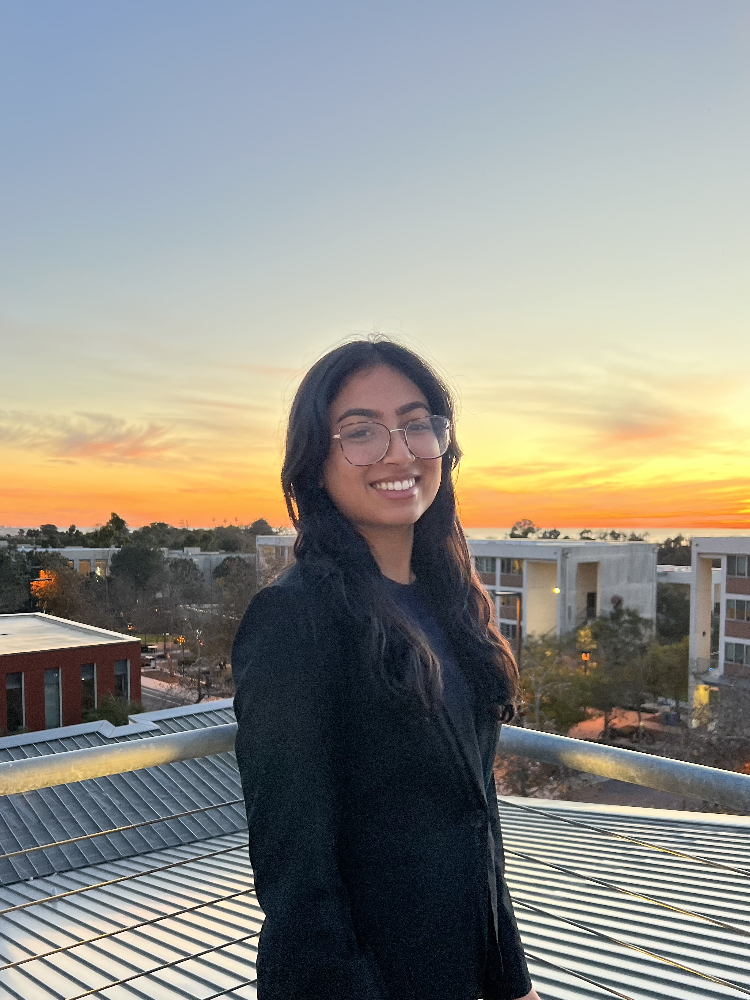
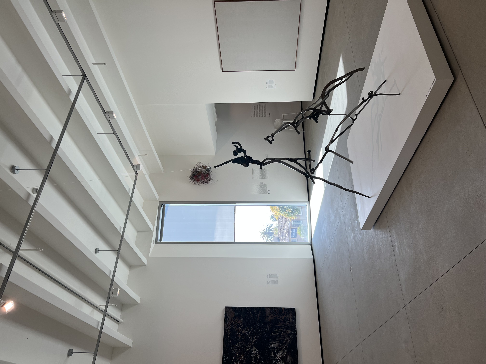
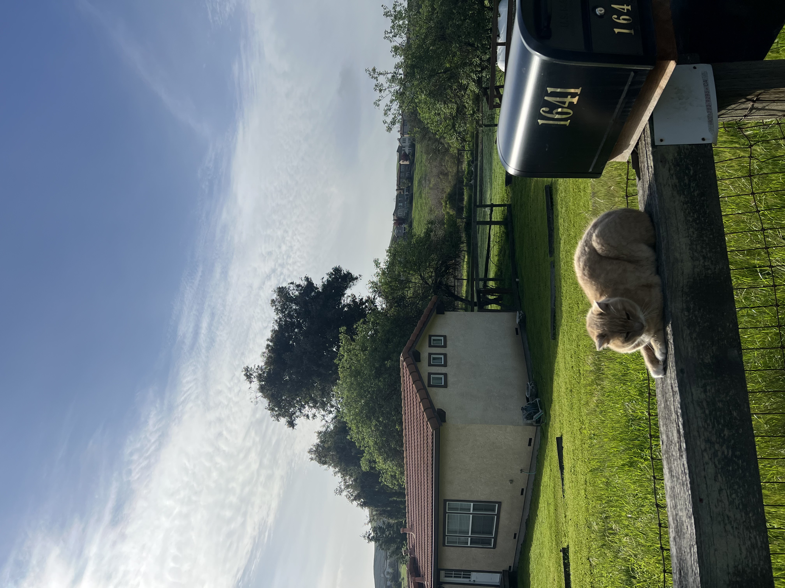

# [Prachi's User Page](#prachis-user-page)

```python
def hello_friend():
    print("Hello, Friend!")
```

## About Me
I'm Prachi, a **third year** studying **Math - CS**. I love sunsets, good matcha, Gossip Girl, playing the guitar, weightlifting, and UCSD of course. 



[View in separate tab](images/pfp.jpg)

## Programming Journey
I started my programming journey feeling a bit behind - because I switched my major in my first year. But I leaned into the challenge, teaching myself through group projects, hackathons, and lots of asking questions to the right people. Over time, I went from feeling like an outsider to realizing that *curiosity*, *persistence*, and a *willingness to learn* were my greatest strengths.

### My Skills
- Full-Stack Web Development 
- Machine Learning & Data Analysis
- Cloud Platforms (AWS, GCP)
- Automation & Scripting
- Communication
- And maybe a few more?

### Top 3 Favorite Programming Languages
1. Typescript
2. Python
3. Java


## Fun Projects
Here are some of my recent projects:

### [Project 1: InnovaAI](#project-1)
 Our AI-driven agents take the guesswork out of early-stage validation, analyzing market potential, assessing feasibility, and providing actionable insights in real time. It's not just a tool—it's like having a strategic co-founder that helps you move forward with clarity and confidence. The future of entrepreneurship isn't about waiting for the perfect moment—it's about taking action with the right data at your fingertips.

[Devpost](https://devpost.com/software/innovaai)


### [Project 2: Data Analysis Dashboard](#project-2)
The leading platform for nursing credentials, validated through professional interviews. Platforms like Pramp/Exponent allow software engineers of all levels and specialities to schedule mock interviews with real people, and we imagined the same for AccredMed. We wanted to create this platform specifically for nurses because nursing education often focuses more on clinical skills and theoretical knowledge. With AccredMed, nurses can practice interviewing skills while gaining a certificate, boosting their employability and credentials

[Devpost](https://devpost.com/software/accredmed)

## Personal Interests
Outside of school, I love exploring museums, a good book, and learning how to play the electric guitar. I also love storytelling/writing, and I started my own blog this year. Lately, I've been enjoying the sunshine at the beach and spending time with people who make me laugh.

> "Be the designer of your world and not merely the consumer of it." - James Clear

## Recent Pictures





## Connect With Me!
- [GitHub](https://github.com/prachiheda)
- [LinkedIn](http://linkedin.com/in/prachi-heda-bb281720b)

## Resources used for this page
Check out these helpful resources:
- [Markdown Guide](https://www.markdownguide.org/)
- [GitHub Documentation](https://docs.github.com/en)

## Some Daily Tasks
- [X] Morning routine
- [X] Workout & stretch
- [X] Reading
- [X] Eat a sweet treat

## Contact Information
ppheda@ucsd.edu

[Back to top](#prachis-user-page)


